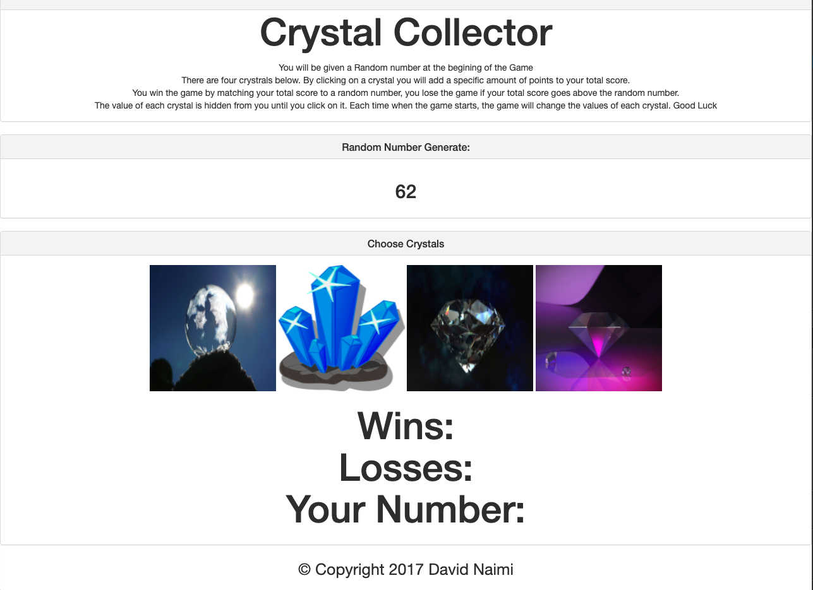

# Crystal Collector Game

## Description

A fun and interactive game for web browsers. Select a crystal and try to add the points up to the randomly generated number

## Screen Shots

## License

This project is licensed under the MIT License - see the [LICENSE](LICENSE) file for details.

## Contributing

If you want to contribute, open a Pull Request and include a detailed description and screenshots of the changes.

## Questions

If you have any questions about the repo, open an issue [DavidNaimi](https://github.com/d88naimi).

## Link

[link to Game!](https://d88naimi.github.io/Crystal-Collector/)
